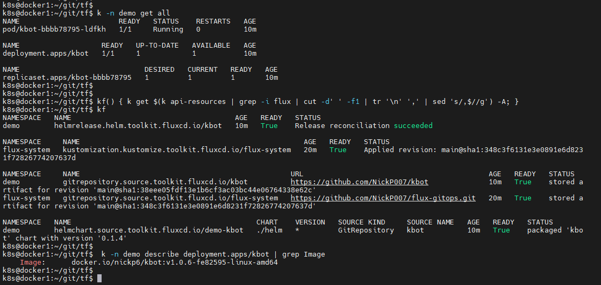

## Тиждень 7

### Задача 3

#### Попередні вимоги

Перед початком розгортання інфраструктури перевіримо наявність наступних вхідних параметрів:

- встановлені утиліти **terraform** та **flux**
- доступ до облікового запису GitHub та згенерований персональний токен з дозолами на читання/запис/видалення репозиторію
- доступ до облікового запису Google Cloud Shell

#### Інсталяція

Перевіримо наявність встановлених утиліт **terraform** та **flux**. За необхідності інсталюємо їх.

  ```bash
  terraform --version
  flux --version
  ```

1.1 Інсталюємо Terraform за допомоги команд:

  ```bash
  sudo apt-get update && sudo apt-get install -y gnupg software-properties-common
  wget -O- https://apt.releases.hashicorp.com/gpg | gpg --dearmor | sudo tee /usr/share/keyrings/hashicorp-archive-keyring.gpg
  echo "deb [signed-by=/usr/share/keyrings/hashicorp-archive-keyring.gpg] https://apt.releases.hashicorp.com $(lsb_release -cs) main" | sudo tee /etc/apt/sources.list.d/hashicorp.list
  sudo apt update
  sudo apt-get install terraform 
  ```

1.2 Інсталюємо flux:

  ```bash
  curl -s https://fluxcd.io/install.sh | sudo bash
  ```

#### Підготовка до розгортання інфраструктури

2.1 Використаємо існуючий персональний токен з дозолами на читання/запис/видалення репозиторію до облікового запису GitHub, за необхідності згенеруємо його.

2.1.1 Генерація персонального токену:

- перейдемо до облікового запису GitHub
- перейдемо до сторінки генерації токенів, натиснувши меню Settings -> Developer settings -> Personal access tokens -> Tokens (classic) -> Generate new token
- вкажемо назву токену в полі *Note*, та виберемо пункти *Full control of private repositories*, *Delete repositories*
- натиснемо Generate Token, зкопіюємо отриманий токен та збережемо в надійному місці

2.2 Для розгортання кластеру на Google Kubernetes Engine (GKE) скористаємося Google Cloud Shell, або локальною консоллю.

При використанні локальної консолі необхідно активувати Google Credentials Key

2.2.1 Активація Google Credentials Key для локальної консолі:

- перейдемо до облікового запису Google Cloud -> Project -> IAM & Admin -> Service Accounts
- натиснемо *Create service account*
- в полі *Service account name* введемо tf_flux, натиснемо *Create and Continue*
- в полі *Select a role* виберемо *Owner* та натиснемо *Continue*
- завершемо створення аккаунту натиснувши *Done*
- в таблиці доступних cервіс-аккаунтів виберемо щойно створений і в полі *Actions* виберемо *Manage Keys*
- натиснемо *Create New Key*, вкажемо формат JSON
- збережемо отриманий ключ в папці `/path/to/key/credentials.json`
- імпортуємо ключ за допомогою команди `export GOOGLE_APPLICATION_CREDENTIALS=/path/to/key/credentials.json`

2.3 Отримаємо інфраструктурний код для розгортання за допомогою **terraform**:

  ```bash
  git clone https://github.com/NickP007/les07.git tf
  cd tf
  ```

> P.S. для розгортання в локальному кластері **Kind**
>
>   ```bash
>   git clone --branch tf_kind --single-branch https://github.com/NickP007/les07 tf_kind
>   cd tf_kind
>   ```

#### Розгортання інфраструктури

3.1 Відредагуємо файл vars.auto.tfvars, вказавши необхідні значення у відповідності до конфігурації

3.2 При необхідності, імпортуємо персональний токен GitHub, отриманий в п.2.1

  ```bash
  export TF_VAR_GITHUB_OWNER=${YOUR_GITHUB_ACCOUNT}
  export TF_VAR_GITHUB_TOKEN=${YOUR_GITHUB_ACCESS_TOKEN}
  ```

3.3 Створемо Google Storage Bucket:

- перейдемо до облікового запису Google Cloud -> Project -> Google Storage -> Buckets
- натиснемо *Create*
- в формі *Name your bucket* у полі *Name* зазначимо 'tf-gke-demo', натиснемо *Continue*
- в формі *Location type* вкажемо 'Region', виберемо регіон, в якому буде створено кластер, натиснемо *Continue*
- в наступних формах *Choose a storage class for your data*, *Choose how to control access to objects*, *Choose how to protect object data* залишимо параметри за змовчуванням натискаючи *Continue*
- завершемо створення сховища натиснувши *Create*

3.4 Розгорнемо Kubernetes Cluster з встановленою системою **flux** за допомогою **terraform**:

  ```bash
  terraform init
  terraform apply
  ```

#### Налаштування GitRepository та HelmRelease на PET-проект

В якості проєкту використаємо вже існуючий проєкт **kbot** за посиланням <github.com/NickP007/kbot>

4.1 Додамо файли конфігурації **flux** за допомогою наступних команд

  ```bash
  git clone https://github.com/${GITHUB_OWNER}/${FLUX_GITHUB_REPO}
  cd ${FLUX_GITHUB_REPO}
  git remote add cl_demo https://github.com/NickP007/les07
  git fetch cl_demo flux_cl_demo
  git merge --allow-unrelated-histories -m "Merge branch 'flux_cl_demo' into main" cl_demo/flux_cl_demo
  read -s TELE_TOKEN
  echo -n $TELE_TOKEN | base64 > clusters/demo/token.txt
  git add clusters/demo/token.txt
  git commit -s -m "Add token.txt to 'demo' cluster"
  git push origin main
  cd ..
  ```

4.2 Перевіримо розгортання коду системою **flux**, та переконаємось в успішності операції:

  ```bash
  alias k="kubectl --kubeconfig=/path/to/tf/.terraform/modules/gke_cluster/kubeconfig"
  alias f="flux --kubeconfig=/path/to/tf/.terraform/modules/gke_cluster/kubeconfig"
  f logs
  k -n demo get all
  kf() { k get $(k api-resources | grep -i flux | cut -d' ' -f1 | tr '\n' ',' | sed 's/,$//g') -A; }
  kf
  ```



4.3 Відкриємо Telegram та відправимо боту команду 'hello'. Отримаємо відповідь (див. мал.4.3)


#### Зміна коду в репозиторії та апдейт іміджу

5.1 Відкриємо репозиторій проєкту **kbot** за посиланням <github.com/NickP007/kbot>.

5.2 Внесемо зміни до проєкту та зробимо коміт.

5.3 Дочекаємося закінчення роботи пайплайн Github Actions, та автоматичного оновлення у Kuberentes кластері у за допомогою flux.

5.4 Перевіримо розгортання коду системою **flux**, та переконаємось в успішності операції (див.п.4.2)


5.5 Відкриємо Telegram та відправимо боту команду 'hello'. Отримаємо відповідь (див. мал.5.5)


### Задача 2

Перенесено до гілки *task02*
